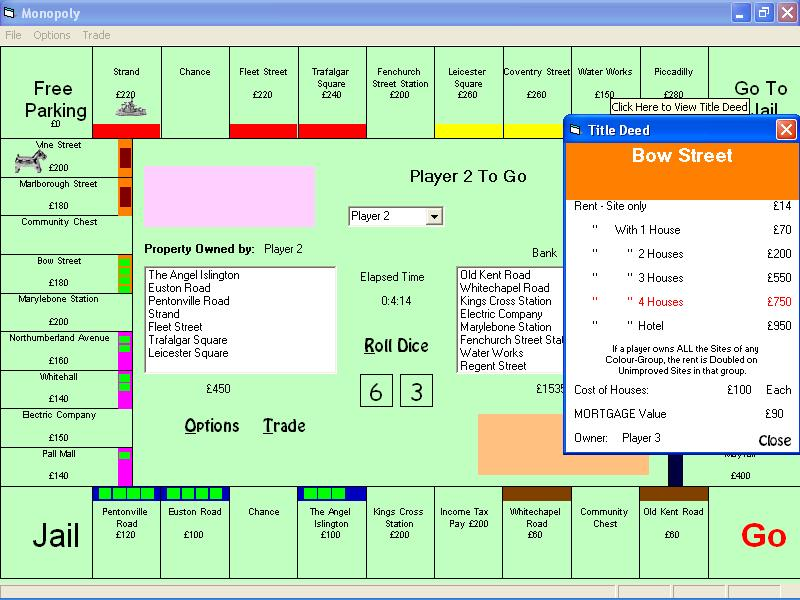



## An Adaptable Monopoly Game  \*UPDATED\*

### Description

An adaptable monopoly game using ADO with an MS Access database and sequential file access. It will allow the user to make alterations to both the content of the game such as property Title/Price/Rent and card contents and to the appearance of the games' user interface. Players can Buy/Sell/Mortgage/Unmortgage property and Buy/Sell Houses & Hotels. There's no instructions or help system but I think the game is mostly self-explanatory.

Improvements include: Choose from 12 different versions including America. Ability to easily create your own versions. Save as many games as you want. More customisation options. Auctions. 6 new actions for Chance/Comm. Chest cards. Improved Jail functions. 12 new tokens. Please comment/vote.

Info for other Country versions available at: http://www.muurkrant.nl/monopoly/country_index.htm
 
### More Info
 
This programme won't run at resolution of less than 800 x 600.

             |
---                |---
**Submitted On**   |2003-02-12 16:10:22
**By**             |[David M Johnston](https://github.com/Planet-Source-Code/PSCIndex/blob/master/ByAuthor/david-m-johnston.md)
**Level**          |Intermediate
**User Rating**    |4.8 (38 globes from 8 users)
**Compatibility**  |VB 6\.0
**Category**       |[Games](https://github.com/Planet-Source-Code/PSCIndex/blob/master/ByCategory/games__1-38.md)
**World**          |[Visual Basic](https://github.com/Planet-Source-Code/PSCIndex/blob/master/ByWorld/visual-basic.md)
**Archive File**   |[An\_Adaptab1543442132003\.zip](https://github.com/Planet-Source-Code/david-m-johnston-an-adaptable-monopoly-game-updated__1-43166/archive/master.zip)

